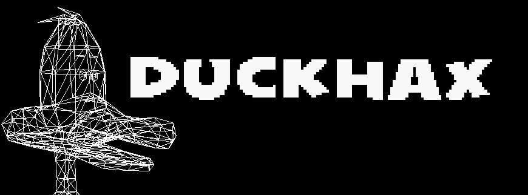

# DuckHax CLI
The CLI-tool for: dumping, building and inspecting game-files for _Sitting Ducks_ by Asobo Studios

## Building
### Requirements
You will need **libpng**, that's about it!

Windows builds haven't been tested yet
```sh
$ mkdir build
$ cd build
$ cmake ..
$ make
```

## Usage
**YOU WILL NEED THE ORIGINAL GAME FILES**

### Dumping:
```sh
$ ./DuckHax dump -i pathToGameDir/ -o dump/
```

### Inspecting:
```sh
$ ./DuckHax inspect -i pathToFile
```

### Building:
As of right now: **You will need a original file** as a reference -> only modifications are possible!

There are just too many unknown variables!
```sh
$ ./DuckHax build -r pathToReference -i pathToFile -o pathOut
```

## Running Sitting Ducks on Linux
The PC release is mess! Even on Windows, the intro-videos won't play!
On wine the game simply crashes, I have yet to find a workaround (but who cares about some intros).
Simply make the videos not accessible OR comment them out in Init.tsc
```sh
cd pathToGame
mkdir videos/backup
mv videos/* videos/backup
```
As of now (2021.04.24) wine's gstreamer crashes when trying to play the music files (sound-effects work just fine)

There are two steps you could take
### Disable music entirely 
```sh
cd pathToGame
mkdir sounds/MUSIC/backup
mv sounds/MUSIC/* sounds/MUSIC/backup
```
### GStreamer workaround
Related issue: https://www.linuxquestions.org/questions/linux-games-33/rpg-maker-games-crash-on-wine-due-to-gstreamer-4175583045/
Dugans fix:
---
[...]
1. using "winecfg", add a library override to disable "winegstreamer"
2. "winetricks quartz amstream"
3. "wineboot -u"
Step 1 isn't needed if you built WINE without gstreamer support. Step 3 absolutely is needed.
[...]
---